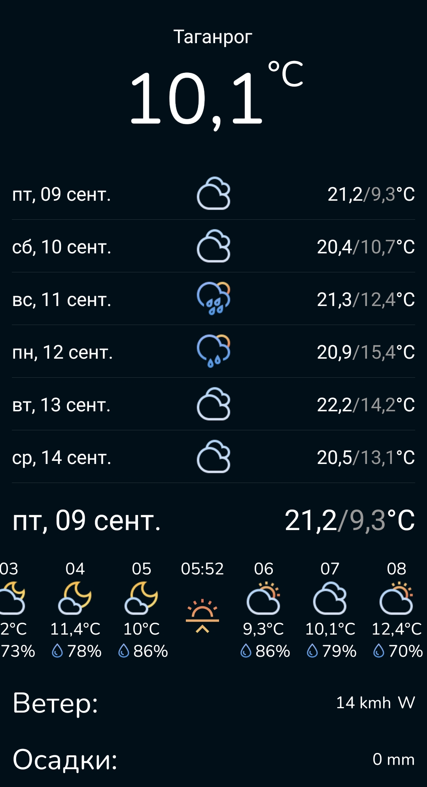
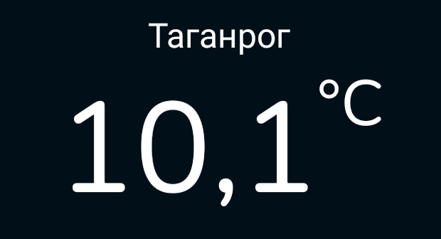
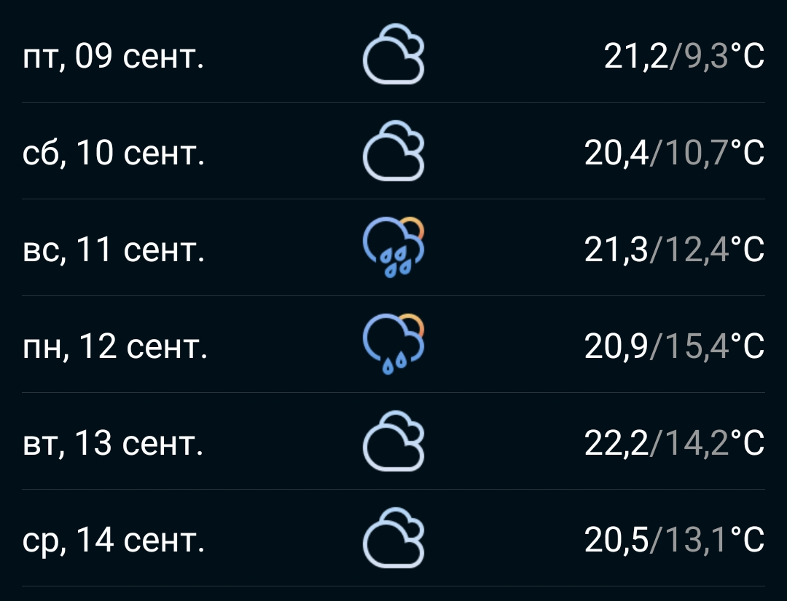
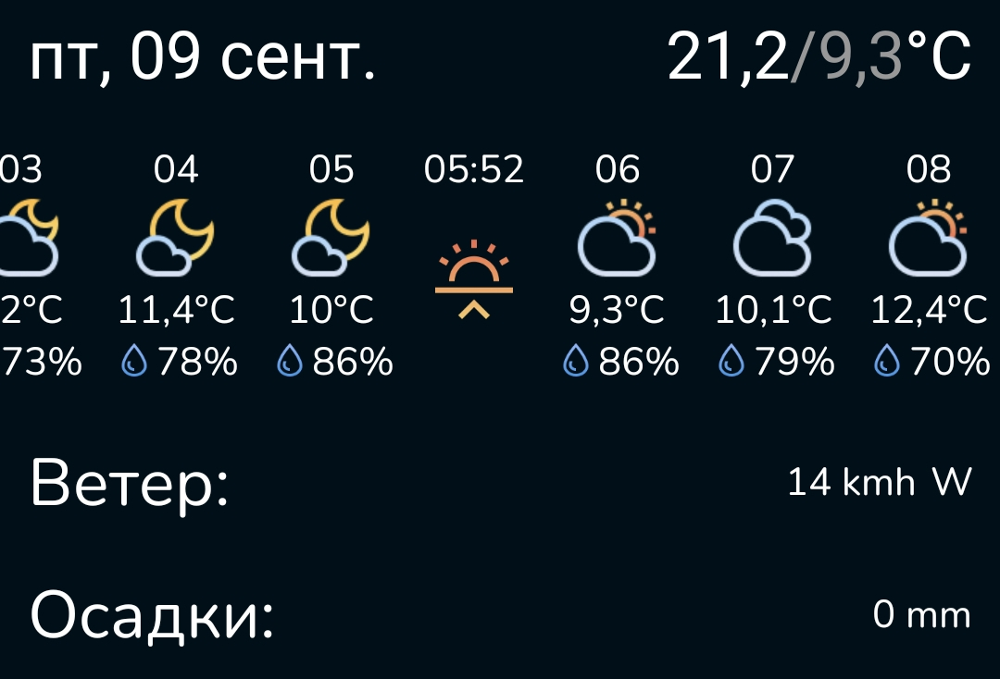
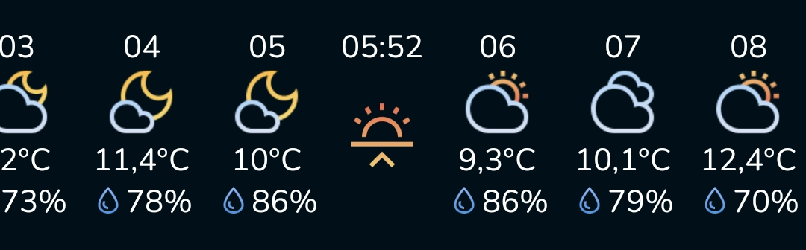

<!-- Improved compatibility of back to top link: See: https://github.com/othneildrew/Best-README-Template/pull/73 -->

<!--
*** Thanks for checking out the Best-README-Template. If you have a suggestion
*** that would make this better, please fork the repo and create a pull request
*** or simply open an issue with the tag "enhancement".
*** Don't forget to give the project a star!
*** Thanks again! Now go create something AMAZING! :D
-->

<!-- PROJECT LOGO -->
 

  

<h2 align="center">WeatherViewer</h3>
  <H3 align="center">
    Простое приложение для просмотра прогноза погоды

<!-- ABOUT THE PROJECT -->
# О проекте

Приложение разработанное в качестве тестового задания c использованием [Open-Meteo](https://open-meteo.com
).

  

### Разработано на
[![Xamarin]][Xamarin-url]

# Особенности

Приложение предназначено для просмотра прогноза погоды.  
Для корректной работы требуется подключение к сети и включённая геолокация.  
**Что бы обновить прогноз потяните экран вниз.**

## Текущая температура

Отображение текущей температуры воздуха и города пользователя.

  

## Почти недельный прогноз

Прогноз погоды на 6 дней вперёд!  
**Нажмите на день в списке, что бы узнать расширенный прогноз на выбранный день.**

  

## Детальный прогноз на день

Прогноз погоды на целый день с почасовой информацией.

  

## Почасовой прогноз

Почасовой прогноз с информацией о погоде, температуре, влажности воздуха и времени рассвета/заката.  
*Иконки погоды меняются в зависимости от времени.* 

  

# Использованные ресурсы

- API: https://open-meteo.com
- Иконки: https://www.figma.com/community/file/1059229179375580154

# Скачать

- [v1.0](https://github.com/KonovalovNikolai/WeatherViewer/releases/tag/v1.0)

<!-- MARKDOWN LINKS & IMAGES -->
<!-- https://www.markdownguide.org/basic-syntax/#reference-style-links -->

[Xamarin]: https://img.shields.io/badge/Xamarin-blue?style=for-the-badge&logo=xamarin&logoColor=white
[Xamarin-url]: https://dotnet.microsoft.com/en-us/apps/xamarin
